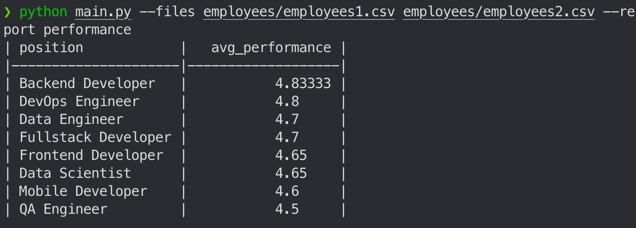
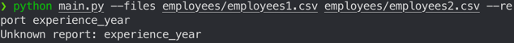

# TestReport

Утилита для генерации отчётов по закрытым задачам на основе CSV-файлов. Позволяет формировать отчёты по эффективности сотрудников, позициям и другим показателям, агрегируя данные из нескольких файлов.

## Расширение

Чтобы добавить новый отчёт:

1. Создать новый файл в папке `reports/`.
    
2. Написать функцию `build_new_report(data)` с сигнатурой `(headers, rows)`.
    
3. Зарегистрировать отчёт в `report_registry.py`

## Пример работы утилиты

